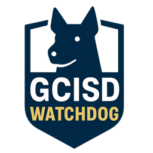

# GCISD Watchdog



With GCISD making important decisions about school closures and rezoning, it's more crucial than ever to stay informed about what happens in Board of Trustees meetings. [GCISD Watchdog](https://chatgpt.com/g/g-691d29038e3481918d416684bc1c0778-gcisd-watchdog) is a custom ChatGPT assistant that lets you ask questions about board meetings in plain English and get answers based on actual meeting transcripts.

**Try the GPT:**
- Search for "GCISD Watchdog" in the GPTs section of ChatGPT, or
- Use this direct link: [GCISD Watchdog GPT](https://chatgpt.com/g/g-691d29038e3481918d416684bc1c0778-gcisd-watchdog)

**What's in this repository:**
This repo contains both the transcription tools and the raw transcripts themselves. You can browse individual meeting transcripts in the [transcripts/](transcripts/) folder or use the tools below to generate your own dataset.

## About Transcript Quality

Current transcripts are generated using the `ggml-tiny.en-q5_1` model, which is the smallest quantized Whisper model available. This allows for fast processing but may result in some inaccuracies in the transcripts.

**Our roadmap:**
1. First, transcribe all available board meetings to ensure complete coverage
2. Then, improve quality by re-transcribing with larger, more accurate models

**Verification:**
The GCISD Watchdog GPT can link back to the original YouTube videos with exact timestamps for direct quotes, making it easy to verify statements in context. However, please note that the authors of this repository are not liable for incorrect transcripts or GPT hallucinations. Always verify important information against the [official GCISD channle](https://www.youtube.com/@GCISDTV).

## Running the Transcription Pipeline

This tool follows a simple process to create a searchable AI assistant from GCISD board meeting videos:

**YouTube Videos** → **download** → **videos/*.webm** → **transcribe** → **transcripts/*.txt** → **assemble** → **gpt/dataset.md**

### Step 1: Build the Docker Image

First, build the container (this downloads the AI transcription model):

```bash
docker compose build
```

### Step 2: Download Board Meeting Videos

Download videos from the GCISD YouTube channel:

```bash
docker compose run --rm download
```

This saves audio streams as `.webm` files in the [videos/](videos/) folder.

### Step 3: Transcribe Videos to Text

Convert the downloaded videos into text transcripts:

```bash
docker compose run --rm transcribe
```

This creates individual `.txt` transcript files in the [transcripts/](transcripts/) folder.

### Step 4: Assemble Dataset for ChatGPT

Combine all transcripts into a single dataset file:

```bash
docker compose run --rm assemble
```

This creates [gpt/dataset.md](gpt/dataset.md) with all meeting transcripts organized by date. Upload this file to ChatGPT to create your AI assistant that can answer questions about GCISD board meetings.
