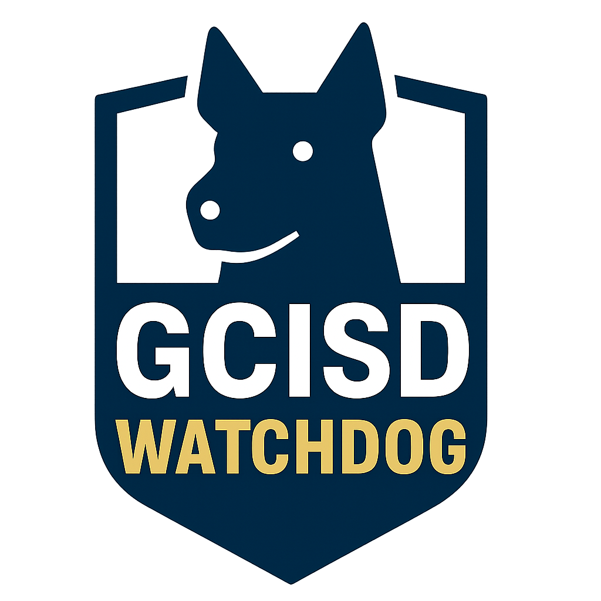

# GCISD Watchdog



[GCISD Watchdog](https://chatgpt.com/g/g-691d29038e3481918d416684bc1c0778-gcisd-watchdog) is an independent community tool that makes Grapevine-Colleyville ISD Board of Trustees meetings easier to understand and search. It continuously downloads board meeting videos from YouTube, transcribes them, and lets you query everything through a conversational AI.

## How to Use This Tool

This tool follows a simple process to create a searchable AI assistant from GCISD board meeting videos:

**YouTube Videos** → **download** → **videos/*.webm** → **transcribe** → **transcripts/*.txt** → **assemble** → **gpt/dataset.md**

### Step 1: Build the Docker Image

First, build the container (this downloads the AI transcription model):

```bash
docker compose build
```

### Step 2: Download Board Meeting Videos

Download videos from the GCISD YouTube channel:

```bash
docker compose run --rm download
```

This saves audio streams as `.webm` files in the [videos/](videos/) folder.

### Step 3: Transcribe Videos to Text

Convert the downloaded videos into text transcripts:

```bash
docker compose run --rm transcribe
```

This creates individual `.txt` transcript files in the [transcripts/](transcripts/) folder.

### Step 4: Assemble Dataset for ChatGPT

Combine all transcripts into a single dataset file:

```bash
docker compose run --rm assemble
```

This creates [gpt/dataset.md](gpt/dataset.md) with all meeting transcripts organized by date. Upload this file to ChatGPT to create your AI assistant that can answer questions about GCISD board meetings.
